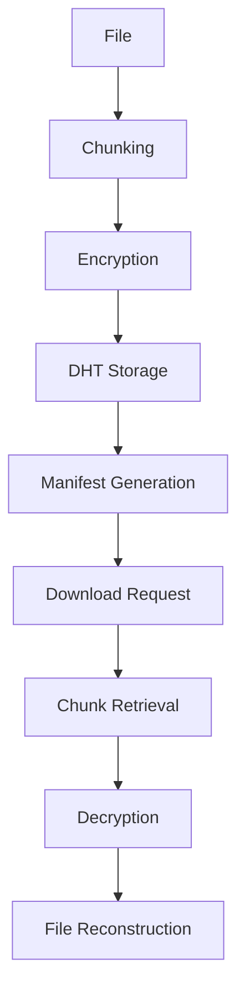
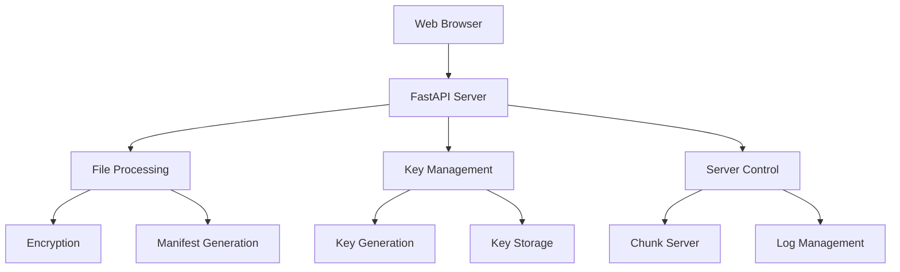

# Privacy-First P2P File Sharing CLI

A secure, privacy-focused peer-to-peer file sharing system with end-to-end encryption. This CLI application allows users to securely share files over a P2P network while maintaining data privacy and security.

## Technical Architecture

### System Components

1. **P2P Network Layer**
   - Kademlia DHT implementation for decentralized storage
   - Peer discovery and routing
   - Distributed chunk storage and retrieval

2. **Security Layer**
   - RSA for asymmetric encryption (key exchange)
   - AES for symmetric encryption (file content)
   - Secure key management and storage

3. **File Management Layer**
   - File chunking and reconstruction
   - Manifest generation and parsing
   - Parallel processing for large files

4. **User Interface Layer**
   - Command-line interface
   - Web-based GUI (optional)
   - Progress tracking and status updates

### Data Flow



## Features

- End-to-end encryption using RSA and AES
- Peer-to-peer file sharing using Kademlia DHT
- Secure file chunking and reconstruction
- Command-line interface for easy file operations
- Key pair generation and management
- Peer discovery and connection
- Parallel processing for improved performance
- Progress tracking and status updates
- Automatic error recovery and retry mechanisms

## Project Structure

```
cli/
├── main.py              # Main CLI application entry point
├── p2p_node.py          # P2P node implementation
├── peer_server.py       # P2P server implementation
├── peer_client.py       # P2P client implementation
├── gui.py              # GUI implementation
├── gui_client.py       # GUI client implementation
├── encryption_utils.py  # Encryption utilities
├── requirements.txt     # Project dependencies
├── templates/          # HTML templates for GUI
├── static/            # Static assets for GUI
├── received_files/    # Directory for downloaded files
├── generated/         # Directory for generated files
└── plots/            # Directory for benchmark plots
```

## Implementation Details

### File Processing

```python
# Example of file chunking and encryption
def process_file(file_path, public_key):
    # 1. Generate AES key
    aes_key = generate_aes_key()
    
    # 2. Chunk file
    chunks = chunk_file(file_path)
    
    # 3. Encrypt chunks
    encrypted_chunks = encrypt_chunks(chunks, aes_key)
    
    # 4. Encrypt AES key with RSA
    encrypted_key = encrypt_with_rsa(aes_key, public_key)
    
    return encrypted_chunks, encrypted_key
```

### P2P Network Operations

```python
# Example of P2P node operations
class P2PNode:
    def __init__(self):
        self.dht = DHT()
        self.peers = set()
    
    def connect_to_peer(self, ip, port):
        # Connect to new peer
        peer = Peer(ip, port)
        self.peers.add(peer)
        
    def store_chunk(self, chunk_id, data):
        # Store chunk in DHT
        self.dht.store(chunk_id, data)
```

## Prerequisites

- Python 3.7 or higher
- pip (Python package manager)
- Network connectivity for P2P operations
- Sufficient disk space for file operations

## Installation

1. Create a virtual environment (recommended):
```bash
python -m venv venv
source venv/bin/activate  # On Windows: venv\Scripts\activate
```

2. Install dependencies:
```bash
pip install -r requirements.txt
```

## Usage

### Starting the Application

Run the main script:
```bash
python main.py
```

### Available Commands

1. **Upload File**
   - Uploads a file to the P2P network
   - Requires receiver's public key
   - Generates a manifest file for sharing
   ```bash
   # Example usage
   Enter file path: /path/to/file.txt
   Enter receiver's public key path: /path/to/public.pem
   ```

2. **Download File**
   - Downloads a file using its manifest
   - Requires your private key
   - Reconstructs the original file
   ```bash
   # Example usage
   Enter manifest path: /path/to/manifest.json
   Enter private key path: /path/to/private.pem
   Enter output path: /path/to/output/
   ```

3. **Generate RSA Keypair**
   - Creates a new RSA key pair
   - Saves public and private keys
   ```bash
   # Generated files
   - my_private.pem
   - my_public.pem
   ```

4. **Connect to Peer**
   - Connect to another peer in the network
   - Requires peer's IP and port
   ```bash
   # Example usage
   Enter peer IP: 192.168.1.100
   Enter peer port: 8000
   ```

5. **Exit**
   - Exits the application

### File Sharing Process

1. **Uploading a File**
   - The file is chunked and encrypted using AES
   - The AES key is encrypted using the receiver's RSA public key
   - Chunks are distributed across the P2P network
   - A manifest file is generated for the receiver
   ```json
   // Example manifest structure
   {
     "filename": "example.txt",
     "chunk_count": 10,
     "encrypted_key": "base64_encoded_key",
     "chunk_hashes": ["hash1", "hash2", ...],
     "chunk_sizes": [1024, 1024, ...]
   }
   ```

2. **Downloading a File**
   - The manifest file is used to locate file chunks
   - The encrypted AES key is decrypted using your private key
   - Chunks are retrieved and decrypted
   - The original file is reconstructed

## Security Features

- End-to-end encryption using RSA and AES
- Secure key exchange
- File chunking for efficient distribution
- Private key protection
- Secure peer-to-peer communication
- Automatic key rotation
- Secure manifest validation
- Integrity checks for downloaded chunks

## Dependencies

- kademlia: P2P DHT implementation
- pycryptodome: Cryptographic operations
- cryptography: Additional cryptographic utilities
- fastapi: Web framework for GUI
- jinja2: Template engine for GUI

## Error Handling

The system implements comprehensive error handling for:
- Network connectivity issues
- File I/O operations
- Encryption/decryption failures
- Peer discovery problems
- Chunk retrieval timeouts
- Invalid manifest files
- Corrupted data chunks

## Performance Considerations

- Parallel chunk processing
- Efficient memory management
- Optimized network operations
- Caching mechanisms
- Progress tracking
- Resource cleanup

## Contributing

1. Fork the repository
2. Create a feature branch
3. Commit your changes
4. Push to the branch
5. Create a Pull Request

## License

This project is licensed under the MIT License - see the LICENSE file for details.

## GUI Interface

The application includes a web-based GUI built with FastAPI and Jinja2 templates, providing an alternative to the CLI interface.

### GUI Components

1. **Web Server**
   - FastAPI-based web application
   - Jinja2 templating for dynamic content
   - Static file serving for assets
   - RESTful API endpoints

2. **User Interface**
   - Modern, responsive web design
   - Real-time progress tracking
   - Interactive file operations
   - Server status monitoring

### GUI Features

1. **File Operations**
   - Drag-and-drop file upload
   - Public key upload interface
   - Manifest file generation
   - Download progress tracking

2. **Key Management**
   - One-click RSA key pair generation
   - Secure key download
   - Key status monitoring

3. **Server Management**
   - Start/stop chunk server
   - Real-time server logs
   - Connection status monitoring
   - Active peer tracking

### GUI Implementation

```python
# Example of GUI route implementation
@app.post("/upload")
async def upload_file(file: UploadFile, pubkey: UploadFile):
    # Handle file upload
    # Process encryption
    # Generate manifest
    return FileResponse(manifest_path)

@app.get("/generate-keys")
async def generate_keys():
    # Generate RSA key pair
    # Return success page
    return TemplateResponse("keys_ready.html")
```

### GUI Usage

1. **Starting the GUI**
   ```bash
   uvicorn gui:app --reload
   ```
   Access the interface at `http://localhost:8000`

2. **File Upload Process**
   - Navigate to the upload page
   - Select file to upload
   - Upload receiver's public key
   - Download generated manifest

3. **Key Generation**
   - Click "Generate Keys" button
   - Download generated key pair
   - Store keys securely

4. **Server Management**
   - Start chunk server with manifest
   - Monitor server status
   - View real-time logs
   - Track active connections

### GUI Architecture



### GUI Security Features

- Secure file upload handling
- Protected key management
- Safe manifest generation
- Secure server control
- Real-time status monitoring
- Error handling and recovery

### GUI Dependencies

- fastapi: Web framework
- jinja2: Template engine
- uvicorn: ASGI server
- python-multipart: File upload handling
- aiofiles: Async file operations
