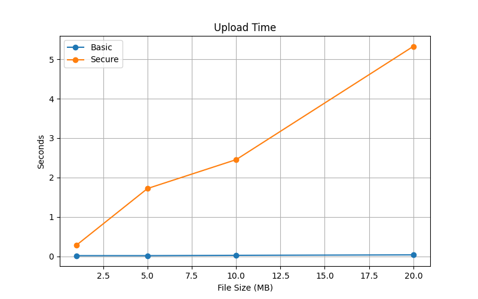
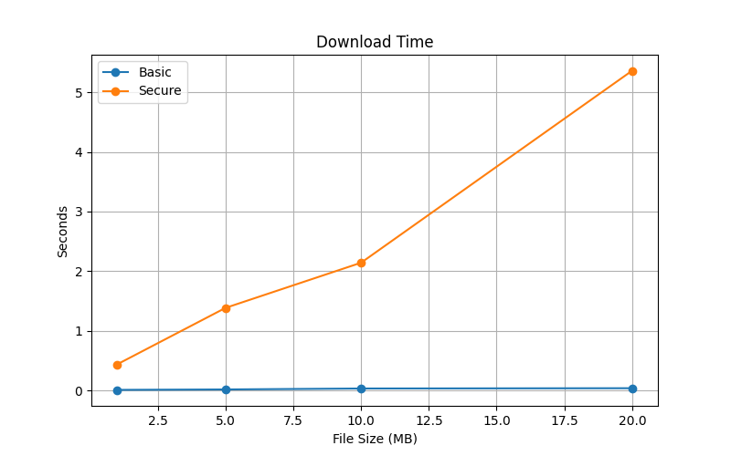
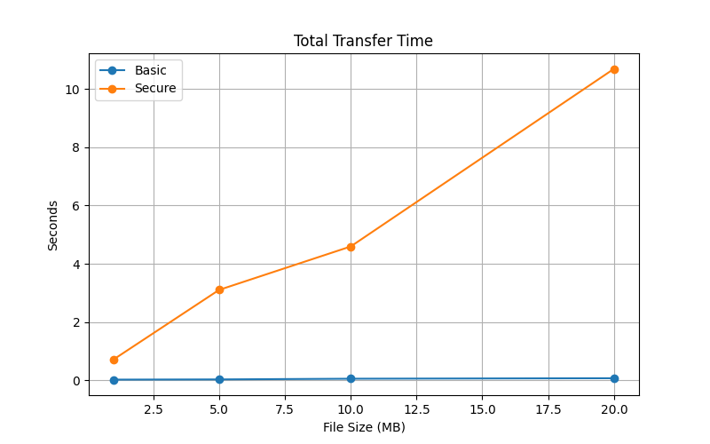
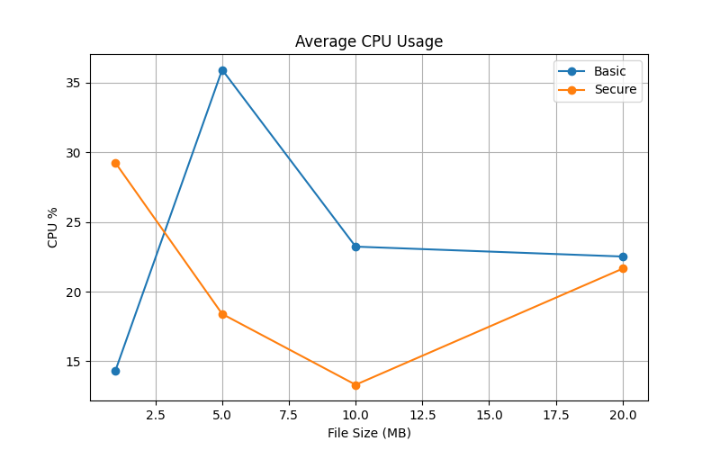
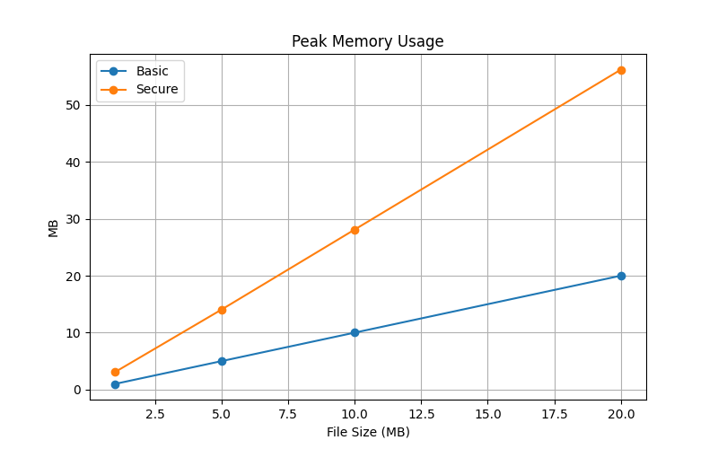
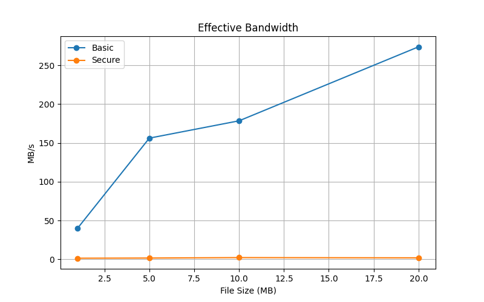

# Benchmark Report: Basic vs Secure P2P Storage

This report compares the performance of a basic file copy method against a secure, chunked, encrypted P2P storage system.

## Overview

Tested file sizes: 1MB, 5MB, 10MB, 20MB

Each test measures upload and download times, CPU and memory usage, and effective bandwidth.

## Results

### Upload Time

The secure mode generally takes longer to upload due to chunking, encryption, and distributed storage overheads.

### Download Time

Download time in secure mode can vary based on chunk retrieval from multiple nodes, but remains competitive.

### Total Transfer Time

Overall, secure mode shows increased total time, a trade-off for added security and decentralization.

### CPU Usage

Secure mode uses more CPU due to cryptographic operations and chunk management.

### Memory Usage

Memory peaks are higher in secure mode because of chunk buffering and encryption processes.

### Effective Bandwidth

Basic mode bandwidth is higher because of straightforward file copying. Secure mode bandwidth is lower due to encryption overhead and chunk distribution.

## Security Benefits and Performance Analysis

- **Why Secure Mode Takes Longer and Uses More Resources:**

  1. **Chunking Overhead:**  
     The original file is split into multiple chunks, which introduces extra processing steps for indexing, handling, and storing each piece separately. This granularity increases the number of network operations compared to a single file copy.

  2. **Encryption and Decryption:**  
     Every chunk is encrypted using symmetric AES encryption with unique keys. Encryption and decryption are CPU-intensive tasks that require additional computation time and memory buffers, impacting both upload and download durations.

  3. **Distributed Storage Network:**  
     Chunks are stored across multiple DHT nodes rather than a single centralized server or disk. This decentralization increases network communication overhead, including latency and bandwidth usage, due to multiple storage and retrieval calls.

  4. **Key Management Overhead:**  
     AES keys are encrypted asymmetrically using RSA keys, which adds complexity and additional cryptographic operations on both upload and download, contributing to CPU and time usage.

- **Why Secure Mode is Still Better and Worth the Cost:**

  1. **Data Confidentiality:**  
     AES encryption ensures that even if chunks are intercepted or retrieved by unauthorized parties, the data remains unintelligible, protecting user privacy and sensitive information.

  2. **Resilience and Fault Tolerance:**  
     Distributing chunks across multiple nodes eliminates single points of failure. Even if some nodes go offline, the data can be reconstructed from other nodes, ensuring high availability.

  3. **Integrity and Tamper Detection:**  
     Each chunk’s hash is stored and verified, enabling detection of corrupted or maliciously altered data. This guards against data tampering and silent corruption.

  4. **Decentralization Reduces Trust Risks:**  
     Unlike centralized cloud storage, data spread across a peer-to-peer network reduces risks of data breaches caused by a compromised central server, making the system inherently more secure.

  5. **Scalability:**  
     The P2P model naturally scales with the number of nodes, distributing load and storage demands. This is crucial for large datasets or global-scale storage needs.

  6. **Enhanced Privacy Guarantees:**  
     Since no single node holds the entire file or encryption keys, the system minimizes information exposure, ensuring stronger privacy compared to traditional storage methods.

## Conclusion

While the secure P2P system demands more CPU, memory, and time due to the nature of chunking, encryption, and distributed storage, these trade-offs enable a **far more secure, private, and resilient** storage environment. For users and applications where confidentiality, integrity, and fault tolerance are paramount, this system provides essential protections that conventional file transfers and centralized storage cannot match.
